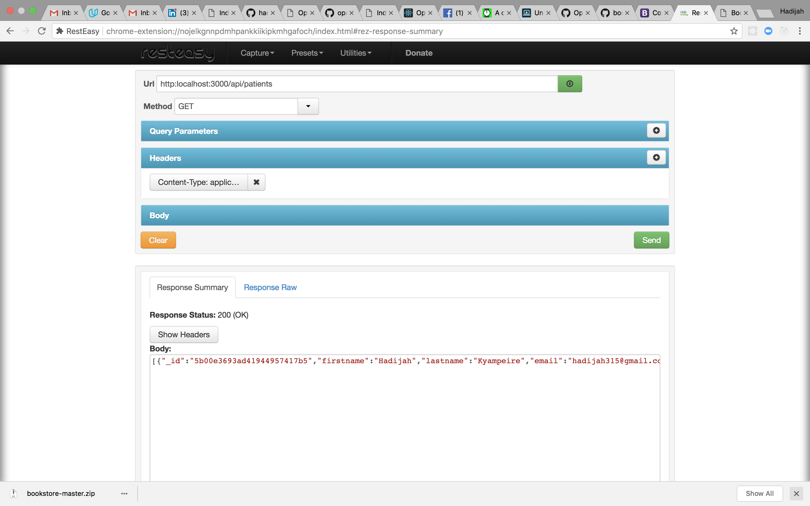

# MedicalRecordsApp
This is an application with an API written in NodeJs and frontend written in AngularJs. It is a medical records App that enables a user to add medicines and patients and manipulation them. 

### Requirements
- Ensure to have mongodb, you can download it [here](https://www.mongodb.com/download-center) 
- Also install express and create a medicinestore database, follow the tutorial [here](https://www.youtube.com/watch?v=eB9Fq9I5ocs&t=3022s)

### Usage
Just clone this repo or download it and run **npm install** to install all dependencies.
After run **node app** or **nodemon** to start.

### Testing Endpoints
You can use Resteasy which is a chrome app or Postman which is also a chrome app or any other client that tests API endpoints.

## Resteasy snapshot

